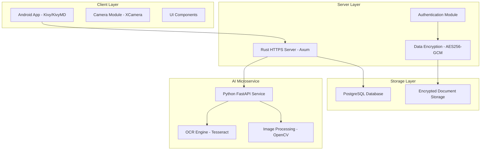

# 🏆 Smart Identity Wallet

<div align="center">


*A secure, AI-powered digital wallet for Romanian identity documents with advanced OCR capabilities*

[Features](#-features) • [Architecture](#-architecture) • [Setup](#-setup) • [Usage](#-usage) • [Contributing](#-contributing)

</div>

---

## 📝 Project Overview

**Smart Identity Wallet** is a comprehensive digital identity management system specifically designed for Romanian identity documents. It combines cutting-edge OCR technology with secure cryptographic storage to provide users with a seamless and secure way to digitize, store, and manage their official documents.

### 🎯 Project Idea

The core concept is to eliminate the need to carry physical identity documents by providing:

- **📱 Mobile-First Design**: Android app with intuitive camera-based document capture
- **🔍 Advanced OCR**: AI-powered text extraction supporting Romanian diacritics and document formats
- **🔐 Cryptographic Security**: AES-256-GCM encryption for sensitive data protection
- **🌐 Self-Hosted**: Complete control over your data with private server deployment
- **🤖 AI Integration**: Smart document processing with automated field validation

---

## 🏗️ Architecture

### System Components



### 🔧 Technology Stack

| Component | Technology | Purpose |
|-----------|------------|---------|
| **Mobile Client** | Python (Kivy/KivyMD) | Cross-platform mobile interface |
| **Backend Server** | Rust (Axum) | High-performance HTTPS API server |
| **AI Service** | Python (FastAPI) | OCR and document processing |
| **Database** | PostgreSQL | Encrypted data persistence |
| **OCR Engine** | Tesseract + OpenCV | Text extraction and image processing |
| **Security** | AES-256-GCM, Argon2 | Data encryption and password hashing |

### 📦 Project Structure

```
Smart-Identity-Wallet/
├── client/                     # Android/Desktop client application
│   ├── frontend/               # Kivy/KivyMD UI components
│   │   ├── screens/            # Application screens
│   │   ├── widgets/            # Custom UI widgets
│   │   └── app.py             # Main application entry point
│   ├── server_requests/        # API communication modules
│   ├── buildozer.spec          # Android build configuration
│   └── main.py                # Client entry point
├── server/                     # Rust backend server
│   ├── src/
│   │   ├── ai_microservice/    # AI service integration
│   │   ├── data_manager/       # Database and encryption
│   │   ├── handle_requests/    # API request handlers
│   │   ├── network/           # HTTPS server and middleware
│   │   └── main.rs            # Server entry point
│   ├── certs/                 # SSL/TLS certificates
│   └── Cargo.toml             # Rust dependencies
├── ai_service/                # Python AI microservice
│   ├── ocr_identitycard.py    # Romanian ID card OCR processor
│   ├── chat_bot.py            # AI chatbot integration
│   ├── main.py                # FastAPI service entry point
│   └── requirements.txt       # Python dependencies
└── README.md                  # This file
```

---

## ⭐ Features

### 🔐 Security & Privacy
- **End-to-End Encryption**: AES-256-GCM encryption for all sensitive data
- **Secure Authentication**: Argon2 password hashing with session management
- **Self-Hosted**: Complete control over your data - no third-party dependencies
- **HTTPS Communication**: All client-server communication over encrypted channels

### 📱 Mobile Experience
- **Intuitive Camera Interface**: Point, shoot, and automatically process documents
- **Real-Time Preview**: Live camera feed with document detection
- **Automatic Document Naming**: Photos saved as `document.jpg` for easy processing
- **Offline Capability**: Core functionality works without internet connection

### 🤖 AI-Powered OCR
- **Romanian Language Support**: Native support for Romanian diacritics (ă, â, î, ș, ț)
- **Multi-Field Extraction**: Automatically extracts:
  - Full name (first and last name separation)
  - CNP (Romanian Personal Numerical Code)
  - Series and number
  - Address
  - Place of birth
  - Expiration date
- **Advanced Image Processing**: 
  - Shadow removal and contrast enhancement
  - Automatic rotation and perspective correction
  - Document boundary detection

### 📋 Document Management
- **Multiple Document Types**: Support for various Romanian documents
  - Identity Cards (Carte de Identitate)
  - Passports (Pașaport)
  - Driving Licenses (Permis de Conducere)
  - Vehicle Registration (Certificat de Înmatriculare)
  - Birth Certificates (Certificat de Naștere)
  - Marriage Certificates (Certificat de Căsătorie)
  - Diplomas and other official documents

### 🔄 Real-Time Processing
- **Live Server Status**: Real-time connection monitoring
- **Background Processing**: Non-blocking OCR processing
- **Progress Indicators**: Visual feedback during document processing

---

## 🚀 Setup & Installation

### Prerequisites

#### System Requirements
- **Operating System**: Linux (Ubuntu 20.04+ recommended), macOS, or Windows
- **Python**: 3.11.9 (for AI service and client)
- **Rust**: 1.70+ (for server)
- **PostgreSQL**: 13+ (for database)
- **Tesseract OCR**: 5.0+ with Romanian language pack

#### For Android Development
- **Java**: OpenJDK 17
- **Android SDK**: API Level 33
- **Android NDK**: r25b

### 🗄️ Database Setup

1. **Install PostgreSQL**:
   ```bash
   # Ubuntu/Debian
   sudo apt update
   sudo apt install postgresql postgresql-contrib
   
   # macOS
   brew install postgresql
   
   # Start PostgreSQL service
   sudo systemctl start postgresql
   ```

2. **Create Database and User**:
   ```bash
   sudo -u postgres psql
   CREATE DATABASE smart_identity_wallet;
   CREATE USER wallet_user WITH PASSWORD 'your_secure_password';
   GRANT ALL PRIVILEGES ON DATABASE smart_identity_wallet TO wallet_user;
   \q
   ```

3. **Configure Environment**:
   Create `/Smart-Identity-Wallet/server/.env`:
   ```env
   DB_NAME=smart_identity_wallet
   DB_USER=wallet_user
   DB_PASSWORD=your_secure_password
   ENCRYPTION_KEY=your_32_byte_base64_key_here
   ```

### 🔑 SSL Certificate Generation

The server requires SSL certificates for HTTPS communication. You have several options:

#### Option 1: Self-Signed Certificates (Development)
```bash
cd /Smart-Identity-Wallet/server
mkdir -p certs

# Generate private key
openssl genrsa -out certs/server.key 2048

# Generate certificate signing request
openssl req -new -key certs/server.key -out certs/server.csr -subj "/C=RO/ST=Bucharest/L=Bucharest/O=Smart Identity Wallet/CN=localhost"

# Generate self-signed certificate
openssl x509 -req -in certs/server.csr -signkey certs/server.key -out certs/server.crt -days 365

# Clean up
rm certs/server.csr
```

#### Option 2: Using mkcert (Recommended for Development)
```bash
# Install mkcert
# Ubuntu/Debian
sudo apt install libnss3-tools
wget -O mkcert https://github.com/FiloSottile/mkcert/releases/download/v1.4.4/mkcert-v1.4.4-linux-amd64
chmod +x mkcert
sudo mv mkcert /usr/local/bin/

# macOS
brew install mkcert

# Initialize mkcert
mkcert -install

# Generate certificates
cd /Smart-Identity-Wallet/server
mkdir -p certs
mkcert -key-file certs/server.key -cert-file certs/server.crt localhost 127.0.0.1 ::1 192.168.1.100
```

#### Option 3: Production Certificates (Let's Encrypt)
```bash
# Install certbot
sudo apt install certbot

# Generate certificate (replace with your domain)
sudo certbot certonly --standalone -d yourdomain.com

# Copy certificates
sudo cp /etc/letsencrypt/live/yourdomain.com/fullchain.pem /Smart-Identity-Wallet/server/certs/server.crt
sudo cp /etc/letsencrypt/live/yourdomain.com/privkey.pem /Smart-Identity-Wallet/server/certs/server.key
sudo chown $USER:$USER /Smart-Identity-Wallet/server/certs/*
```

### 🧠 AI Service Setup

1. **Install Python Dependencies**:
   ```bash
   cd /Smart-Identity-Wallet/ai_service
   
   # Create virtual environment (recommended)
   python3.11 -m venv venv
   source venv/bin/activate  # On Windows: venv\Scripts\activate
   
   # Install dependencies
   pip install -r requirements.txt
   ```

2. **Install Tesseract with Romanian Support**:
   ```bash
   # Ubuntu/Debian
   sudo apt update
   sudo apt install tesseract-ocr tesseract-ocr-ron
   
   # macOS
   brew install tesseract tesseract-lang
   
   # Verify installation
   tesseract --list-langs  # Should include 'ron'
   ```

3. **Configure AI Service Environment**:
   Create `/Smart-Identity-Wallet/ai_service/.env`:
   ```env
   API_AI=your_google_ai_api_key_here  # Optional, for chatbot features
   ```

4. **Create Fixed Requirements File**:
   ```bash
   cd /Smart-Identity-Wallet/ai_service
   cat > requirements.txt << 'EOF'
   fastapi==0.104.1
   uvicorn[standard]==0.24.0
   python-multipart==0.0.6
   google-generativeai==0.3.2
   opencv-python==4.8.1.78
   pytesseract==0.3.10
   pillow==10.1.0
   numpy==1.24.3
   python-dotenv==1.0.0
   EOF
   
   pip install -r requirements.txt
   ```

### ⚙️ Server Setup

1. **Install Rust**:
   ```bash
   curl --proto '=https' --tlsv1.2 -sSf https://sh.rustup.rs | sh
   source $HOME/.cargo/env
   ```

2. **Build and Run Server**:
   ```bash
   cd /Smart-Identity-Wallet/server
   
   # Build the server
   cargo build --release
   
   # Run the server
   cargo run
   ```

   The server will start on `https://0.0.0.0:8443`

### 📱 Client Setup

#### For Desktop Testing
1. **Install Python Dependencies**:
   ```bash
   cd /Smart-Identity-Wallet/client
   
   # Create virtual environment
   python3.11 -m venv venv
   source venv/bin/activate
   
   # Install Kivy dependencies
   pip install kivy[base] kivymd requests pillow qrcode[pil]
   
   # Run the client
   python main.py
   ```

#### For Android Build
1. **Install Buildozer**:
   ```bash
   # Install system dependencies
   sudo apt update
   sudo apt install -y git zip unzip openjdk-8-jdk python3-pip autoconf libtool pkg-config zlib1g-dev libncurses5-dev libncursesw5-dev libtinfo5 cmake libffi-dev libssl-dev
   
   # Install buildozer
   pip install buildozer cython
   ```

2. **Configure Buildozer**:
   The `buildozer.spec` file is already configured. Key settings:
   ```ini
   requirements = python3,kivy==2.3.1,requests,urllib3,kivymd,pillow,qrcode
   android.permissions = INTERNET,ACCESS_NETWORK_STATE,ACCESS_WIFI_STATE,CAMERA,WRITE_EXTERNAL_STORAGE,READ_EXTERNAL_STORAGE,MANAGE_EXTERNAL_STORAGE,READ_MEDIA_IMAGES,READ_MEDIA_VIDEO
   android.api = 33
   android.ndk = 25b
   ```

3. **Build Android APK**:
   ```bash
   cd /Smart-Identity-Wallet/client
   
   # Clean build (recommended for first build)
   buildozer android clean
   
   # Build APK
   buildozer android debug
   
   # The APK will be in bin/ folder
   ```

---

## 🎮 Usage Guide

### 🚀 Starting the System

1. **Start the AI Service** (Port 8001):
   ```bash
   cd /Smart-Identity-Wallet/ai_service
   source venv/bin/activate
   python main.py
   ```

2. **Start the Server** (Port 8443):
   ```bash
   cd /Smart-Identity-Wallet/server
   cargo run
   ```

3. **Launch the Client**:
   ```bash
   cd /Smart-Identity-Wallet/client
   source venv/bin/activate
   python main.py
   ```

### 📲 Using the Mobile App

1. **Server Configuration**:
   - Launch the app and enter your server IP address
   - Default format: `https://192.168.1.100:8443`
   - The app automatically adds HTTPS and port 8443 if not specified

2. **Account Management**:
   - Register a new account or login with existing credentials
   - All passwords are securely hashed with Argon2

3. **Document Capture**:
   - Navigate to the camera screen
   - Point your camera at a Romanian identity document
   - Tap the capture button
   - The image is automatically saved as `document.jpg` in `/storage/emulated/0/Pictures/SmartID/`

4. **OCR Processing**:
   - After capture, the app automatically processes the document
   - Extracted fields are displayed for review and editing
   - Data can be saved to your secure digital wallet

### 🔧 API Endpoints

#### Public Endpoints
- `GET /health` - Server health check
- `POST /login` - User authentication
- `POST /register` - User registration

#### Protected Endpoints (Require Authentication)
- `POST /api/message` - General data operations
- `POST /api/AI` - OCR and AI processing
- `GET /api/data` - Retrieve user data

#### AI Service Endpoints
- `GET /health` - AI service health check
- `POST /chat` - AI chatbot interactions
- `POST /ocr` - Document OCR processing

---

## 🔧 Configuration

### Server Configuration

#### Environment Variables (.env)
```env
# Database Configuration
DB_NAME=smart_identity_wallet
DB_USER=wallet_user
DB_PASSWORD=your_secure_password

# Encryption Key (32 bytes, base64 encoded)
ENCRYPTION_KEY=your_32_byte_base64_key_here
```

#### Generate Encryption Key
```bash
# Generate a secure 32-byte key
openssl rand -base64 32
```

### Client Configuration

#### Server Connection
- Default server: `https://127.0.0.1:8443`
- Configurable through the app's server setup screen
- Supports both IP addresses and domain names

#### Document Storage
- Android: `/storage/emulated/0/Pictures/SmartID/`
- Desktop: `~/Pictures/SmartID/`

### AI Service Configuration

#### OCR Settings
The OCR processor supports various configuration options in `ocr_identitycard.py`:

```python
# Image processing parameters
TARGET_WIDTH = 1000
TARGET_HEIGHT = 325

# Tesseract configurations for different fields
DEFAULT_TESS_CONFIG = {
    "place_of_birth": r'--psm 13 -c tessedit_char_whitelist= abcdefghijklmnopqrstuvwxyzABCDEFGHIJKLMNOPQRSTUVWXYZăâîșțĂÂÎȘȚ.',
    "address": r'--psm 13 -c tessedit_char_whitelist= abcdefghijklmnopqrstuvwxyzABCDEFGHIJKLMNOPQRSTUVWXYZăâîșțĂÂÎȘȚ.',
    "nume_full": r'--psm 7 -c tessedit_char_whitelist=AĂÂBCDEFGHIÎJKLMNOPQRSȘTȚUVWXYZ< --oem 3',
    "serie_nr": r'--psm 7 -c tessedit_char_whitelist=0123456789ABCDEFGHIJKLMNOPQRSTUVWXYZ< --oem 3',
    "cnp": r'--psm 7 -c tessedit_char_whitelist=0123456789MF --oem 3'
}
```

---

## 🛠️ Development

### Python Dependencies

#### AI Service Requirements (Python 3.11+)
```txt
fastapi==0.104.1
uvicorn[standard]==0.24.0
python-multipart==0.0.6
google-generativeai==0.3.2
opencv-python==4.8.1.78
pytesseract==0.3.10
pillow==10.1.0
numpy==1.24.3
python-dotenv==1.0.0
```

#### Client Requirements (Python 3.11+)
```txt
kivy==2.3.1
kivymd==1.1.1
requests==2.31.0
pillow==10.1.0
qrcode[pil]==7.4.2
```

### Rust Dependencies

See `server/Cargo.toml` for complete dependency list:
- **axum**: Web framework
- **tokio**: Async runtime
- **axum-server**: HTTPS support
- **tokio-postgres**: Database driver
- **argon2**: Password hashing
- **aes-gcm**: Encryption
- **reqwest**: HTTP client for AI service communication

### 🧪 Testing

#### Test OCR Functionality
```bash
cd /Smart-Identity-Wallet/ai_service
python -c "
from ocr_identitycard import IDCardProcessor
processor = IDCardProcessor()
result = processor.process_id_card('path/to/test/image.jpg')
print(result)
"
```

#### Test Server Health
```bash
curl -k https://localhost:8443/health
```

#### Test AI Service
```bash
curl http://localhost:8001/health
```

---

## 📋 Troubleshooting

### Common Issues

#### 1. Certificate Errors
```
Error: "error, certs" when starting server
```
**Solution**: Ensure certificates exist in `server/certs/`:
```bash
ls -la /Smart-Identity-Wallet/server/certs/
# Should show: server.crt and server.key
```

#### 2. Database Connection Issues
```
Error: "DB_NAME must be set"
```
**Solution**: Create proper `.env` file in server directory with database credentials.

#### 3. OCR Not Working
```
Error: "TesseractNotFoundError"
```
**Solution**: Install Tesseract with Romanian language support:
```bash
sudo apt install tesseract-ocr tesseract-ocr-ron
tesseract --list-langs  # Verify 'ron' is listed
```

#### 4. Android Build Fails
```
Error: CMake compatibility issues
```
**Solution**: Update buildozer.spec requirements to remove problematic packages:
```ini
requirements = python3,kivy==2.1.0,kivymd,pillow,requests,qrcode
```

#### 5. Python Service Crashes Immediately
```
Service starts then immediately exits
```
**Solution**: Check requirements.txt format and install dependencies:
```bash
pip install fastapi uvicorn opencv-python pytesseract pillow numpy python-dotenv
```

### Port Configuration

- **Server**: 8443 (HTTPS)
- **AI Service**: 8001 (HTTP)
- **Database**: 5432 (PostgreSQL default)

### Performance Optimization

#### For Better OCR Results
1. **High-quality images**: Use good lighting and stable camera
2. **Document positioning**: Ensure document fills most of the frame
3. **Clean backgrounds**: Avoid patterns behind the document

#### For Server Performance
1. **Database indexing**: Ensure proper indexes on frequently queried fields
2. **Connection pooling**: Configure optimal database connection pool size
3. **Caching**: Implement Redis for session caching in production

---

## 🤝 Contributing

We welcome contributions to the Smart Identity Wallet project! Here's how you can help:

### Development Setup
1. Fork the repository
2. Clone your fork
3. Follow the setup instructions above
4. Create a feature branch
5. Make your changes
6. Test thoroughly
7. Submit a pull request

### Code Style
- **Python**: Follow PEP 8 style guidelines
- **Rust**: Use `cargo fmt` for formatting
- **Comments**: Write clear, descriptive comments
- **Documentation**: Update README for any new features

### Areas for Contribution
- 📱 UI/UX improvements
- 🔍 OCR accuracy enhancements
- 🌐 Additional language support
- 🔐 Security improvements
- 📋 Additional document types
- 🧪 Test coverage

---

## 🙏 Acknowledgments

- **Tesseract OCR**: For excellent open-source OCR capabilities
- **Kivy/KivyMD**: For cross-platform mobile development framework
- **Axum**: For high-performance Rust web framework
- **FastAPI**: For modern Python API development
- **OpenCV**: For computer vision and image processing

---

<div align="center">

**Smart Identity Wallet** - Securing your digital identity, one document at a time.

Made with ❤️ for the Romanian digital identity ecosystem.

---

</div>